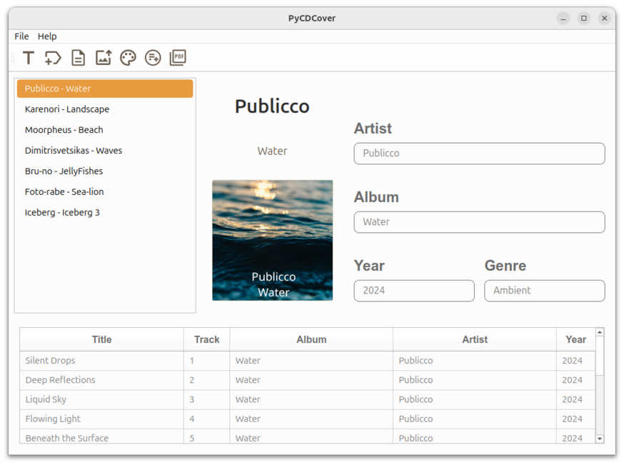
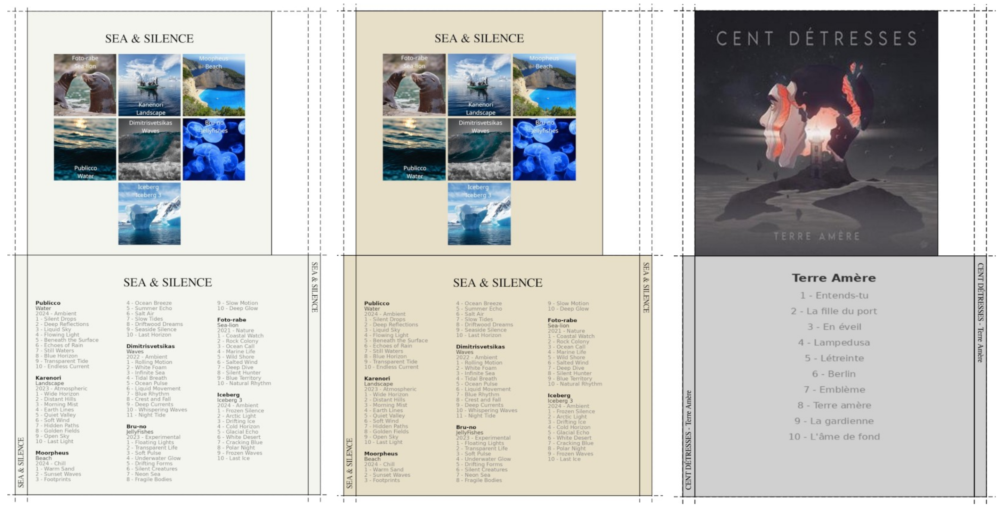

---
# the default layout is 'page'

title: Projet PyCDCover
icon: fas fa-wrench  
order: 7 
---

## 1. Présentation de PyCDCover

PyCDCover est un générateur de jaquettes (pochettes):

- pour des maquettes d'albums (un album par CD)

- pour des CD multi-albums (plusieurs albums par CD)
  
  Il est préférable de travailler directement avec des dossiers de fichiers musicaux 

## 2. Interface



## 3. Fonctionnement du logiciel

Avant d'utiliser le CD, il faut taguer les chansons du dossier (éviter celui du CD). On peut utiliser Easytag, par exemple. Sans ces informations (artist, album, année, genre, titres), le logiciels ne pourra pas traiter ces informations nécessaires.
Les tags récupérés, le nom des artistes et des albums permettent de récupérer depuis des sites internet les photos de la jaquette (pochette).

Sur le logiciel, de la gauche vers la droite, il faut appuyer sur:

1. Donner un nom au CD. Pour une maquette - 1 album), il faut donner le nom de l'ariste à ce titre.

2. Récupérer les tags du dossier ou du CD

3. Éditer et/ou modifier les valeurs des tags

4. Récupérer les images à partir de Itunes

5. Sélectionner la couleur de fond

6. Créer les faces avant et arrières du CD

7. Générer le PDF

Ci-dessous trois exemples de résultats. la maquette unique a été faite avec l'accord du groupe @CENT DÉTRESSES -  Cliquer sur l'image pour l'agrandir.


*Exemple de Jaquettes (pochettes) de CD*

## 4. Un peu de code

Ce code désactive ou active les widgets pour l'option recherche dans le lycée :

```python
class Titres:
    """Crée les images des titres (horizontal et verticaux) pour la jaquette CD."""

    def __init__(self, L_devant: int, H_back_cover: int, titre: str) -> None:
        self.titre = titre
        self.L_devant = L_devant
        self.H_back_cover = H_back_cover
        self.x = 0
        self.y = 0
        # dossiers
        self.dossier_racine = Path(__file__).parent.parents
        self.dossier_polices = self.dossier_racine / "ressources" / "polices"
        self.dossier_pycdcover = Path.home() / "PyCDCover"

    def titre_horizontal(self) -> None:
        """Création de l'image horizontale du titre"""
        # image contenant le titre horizontal
        imageH = Image.new("RGB", (self.L_devant, 220), "white")
        draw = ImageDraw.Draw(imageH)
        police1 = self.dossier_polices / "FreeSerif.ttf"
        font1 = ImageFont.truetype(str(police1), 60)
        bbox = draw.textbbox((0, 0), self.titre, font=font1)
        largeur_texte = bbox[2] - bbox[0]
        x = (self.L_devant - largeur_texte) / 2
        y = 60
        draw.text((x, y), self.titre, fill="black", font=font1)
        imageH.save(self.dossier_pycdcover / "TitreH.png", "PNG")
```

## 5. Technologie

Python 3, PySide6, Reportlab

## 5. Conclusion

PyCDCOver a été le deuxième logiciel conséquent que j'ai créé. Son interface était trop sommaire pour qu'il fut très utilisé. Mais il était référencé, donc
téléchargé (des dizaines de milliers de vues). Pyside6 m'a permis d"améiorer plus la robuste du programme en uilisant la technologie MVC. Une interface plus attrayante a été concçue, plus aérée plus plus belle et ergonomique

## 6. liens

[Téléchargement - PyCDCover](https://github.com/GerardLeRest/pycdcover-v2/releases) <br>
[Github - PyCDCover](https://github.com/GerardLeRest/pycdcover-v2)
<br>
[page Wiki - Ubuntu-fr](https://doc.ubuntu-fr.org/pycdcover)
